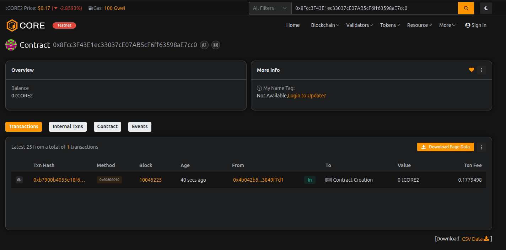

# ChainSaver Treasury

## Project Description

ChainSaver Treasury is a decentralized smart contract-based treasury management system built on the Ethereum blockchain. It enables users to securely deposit, manage, and withdraw their funds while providing advanced features like savings goals, beneficiary management, and emergency controls. The contract acts as a secure vault for individuals and organizations to manage their digital assets with transparency and accountability.

## Project Vision

Our vision is to create a trustless and transparent financial management system that empowers individuals and organizations to take control of their digital assets. ChainSaver Treasury aims to bridge traditional treasury management with blockchain technology, offering security, accessibility, and programmable financial operations without intermediaries.

## Key Features

- **Secure Deposits & Withdrawals**: Users can deposit ETH into the treasury and withdraw their funds at any time
- **Savings Goal Tracking**: Set and monitor savings goals to achieve financial milestones
- **Beneficiary Management**: Add beneficiaries with specific allowances for controlled fund distribution
- **Fund Allocation**: Allocate funds to approved beneficiaries within their allowance limits
- **Emergency Mode**: Owner-controlled emergency mode to pause operations when needed
- **Transparent History**: Track all deposits with timestamp records for complete transparency
- **Balance Tracking**: Real-time tracking of individual user balances and total contract balance
- **Access Control**: Owner-only functions for critical operations ensuring security
- **Event Logging**: Comprehensive event emissions for all major operations
- **Fallback Support**: Receive ETH through direct transfers with automatic tracking

## Future Scope

1. **Time-Locked Savings**: Implement time-locked deposits with interest rewards for long-term savers
2. **Multi-Signature Support**: Add multi-sig wallet functionality for enhanced security in organizational use
3. **Token Support**: Extend support beyond ETH to include ERC-20 tokens
4. **Governance System**: Implement DAO-style governance for community-driven treasury decisions
5. **Automated Yield Strategies**: Integration with DeFi protocols for passive income generation
6. **Recurring Deposits**: Enable automated recurring deposit schedules
7. **Spending Limits**: Implement daily/weekly spending limits for enhanced budget control
8. **Mobile Integration**: Develop mobile application for easy access and management
9. **Analytics Dashboard**: Build comprehensive analytics for tracking financial metrics
10. **Cross-Chain Support**: Enable cross-chain treasury management for multi-blockchain portfolios

---

## Contract Details:

Transaction id: 0x8Fcc3F43E1ec33037cE07AB5cF6ff63598aE7cc0
